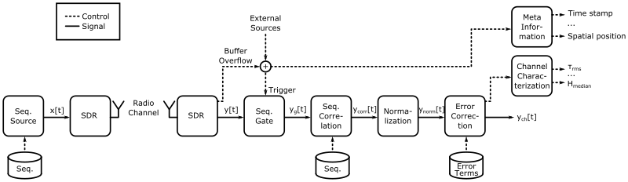
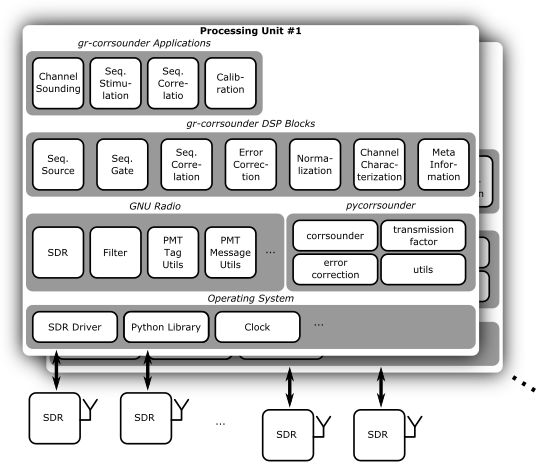

# gr-corrsounder

# Requirements

 * GNU Radio
 * python package psutil
 * python package scipy

# Build/Install instructions

1. Install/Build GNU Radio (it is recommended to use [PyBOMBS](https://github.com/gnuradio/pybombs))

2. Get *gr-corrsounder* from github - `git clone https://github.com/inIT-HF/gr-corrsounder.git`

3. Optional: Change to which prefix *gr-corrsounder* shall be installed - `source ~/corrsounder_prefix/setup_env.sh`

4. Configure *gr-corrsounder* - `mkdir build && cd build && cmake ../`

5. Build and install *gr-corrsounder* - `make && sudo make install` 

# Contributors

 * Niels Fliedner
 * Dimitri Block

# References
1. Niels Hendrik Fliedner, Dimitri Block, Uwe Meier “A Software-Defined Channel Sounder for Industrial Environments with Fast Time Variance”. Submitted to the 15th International Symposium on Wireless Communication Systems (ISWCS 2018). [Arxiv preprint](https://arxiv.org/abs/1805.01236)
