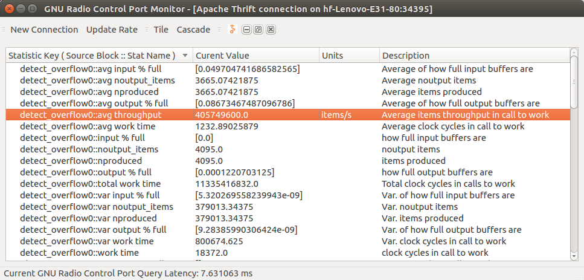

It is considered good practice to add examples in here to demonstrate the
functionality of your OOT module. Python scripts, GRC flow graphs or other
code can go here.

# Performance

## Detect Overflow

 * Plattform: Lenovo Notebook Thinkpad T450s
 * CPU: Intel Core i7-5600U CPU @ 2.60GHz × 4 
 * OS: Ubuntu 16.04 64bit
 * Gnuradio: 3.7.11
 * Average items to process per overflow: 51200
 * Average item process rate: >400MHz
